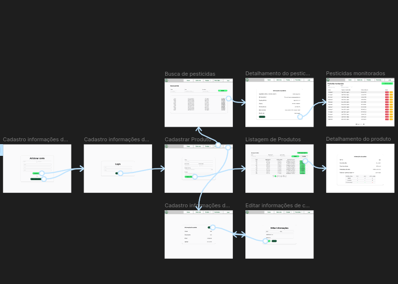
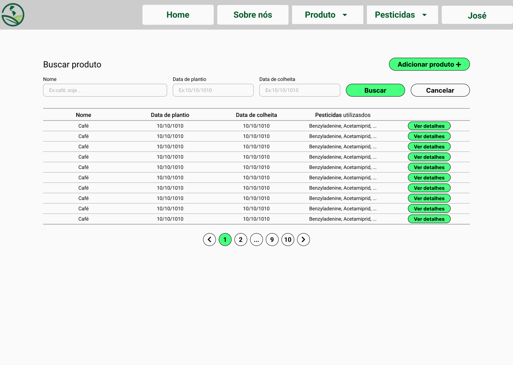
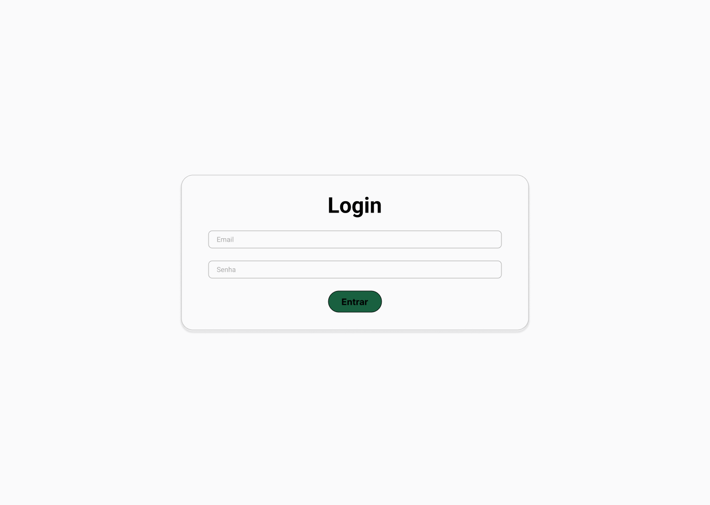

# Projeto de Interface

Visão geral da interação do usuário pelas telas do sistema e protótipo interativo das telas com as funcionalidades que fazem parte do sistema (wireframes).

## User Flow

## Wireframes - PesticideTracker

### Wireframe 01 - Listagem de produtos cadastrados

O wireframe descreve o requisito RF002, com a lista de produtos cadastrados, também é possível visualizar um filtro e uma paginação, com o objetivo de facilitar a navegação do usuário. Na tela também é possivel que o usuário siga para a tela de cadastro de produtos e para a tela de detalhamento do produto.

### Wireframe 03 - Cadastro informações de contato

O wireframe descreve o requisito RF009, com campos para entrada de email, celular, nome e senha o usuário pode fornecer suas informações para contato, além de permitir a criação de um perfil onde ficarão salvas as outras informações fornecidas ao sistema.
Caso o usuário já possua uma conta, o mesmo pode ser direcionar para a tela de login.

### Wireframe 04 - Editar informações de contato

O wireframe descreve o requisito RF011, com campos para email, celular e nome que permite que o usuário mude as suas informações previamente cadastradas.

### Wireframe 05 - Visualizar informações de contato

O wireframe descreve o requisito RF010, onde são exibidos os dados previamente cadastrados, além de ser oferecida a possibilidade de se direcionar para uma página onde poderá editá-los.

### Wireframe 06 - Login

O wireframe descreve o requisito RF008, essa tela permite que o usuário já cadastrado e em posse de email e senha, tenha acesso aos dados salvos por ele anteriormente.

### Wireframe 07 - Detalhamento do produto

O wireframe descreve o requisito RF003, nessa tela é possível visualizar características de um produto agrícola, como qual produto está sendo comercializados, momento de colheita e de plantio, bem como cada pesticida utilizado e como cada um desses pesticidas afetou os possíveis mercados desse produto.

### Wireframe 08 - Cadastrar Produto

O wireframe descreve o requisito RF001, a tela permite que o usuário cadastre um novo produto, incluindo informações básicas como nome, momento de plantio e momento de colheita, bem como informações especificas como pesticidas utilizados e mercados que deseja atingir.

### Wireframe 09 - Busca de pesticidas

O wireframe descreve o requisito RF005, com a lista de pesticidas no banco de dados local o usuário pode fazer uma busca por pesticidas baseado no nome do pesticida e em suas características.

### Wireframe 10 - Detalhamento do pesticida

O wireframe descreve os requisitos RF005 e RF006, onde o sistema permite que o usuário consulte a situação do pesticida específico e também que o usuário cadastre um monitoramento contínuo do mesmo.

