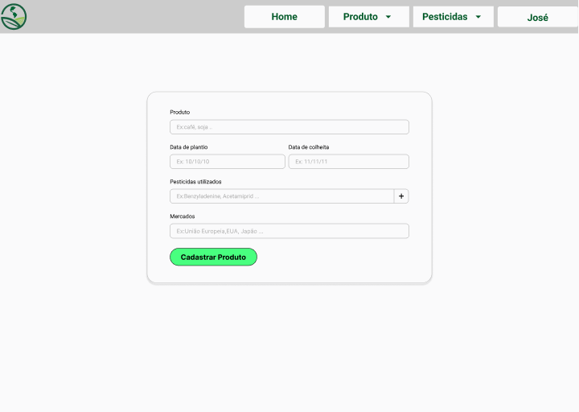
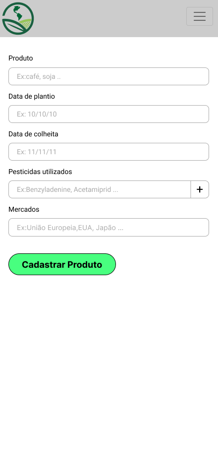
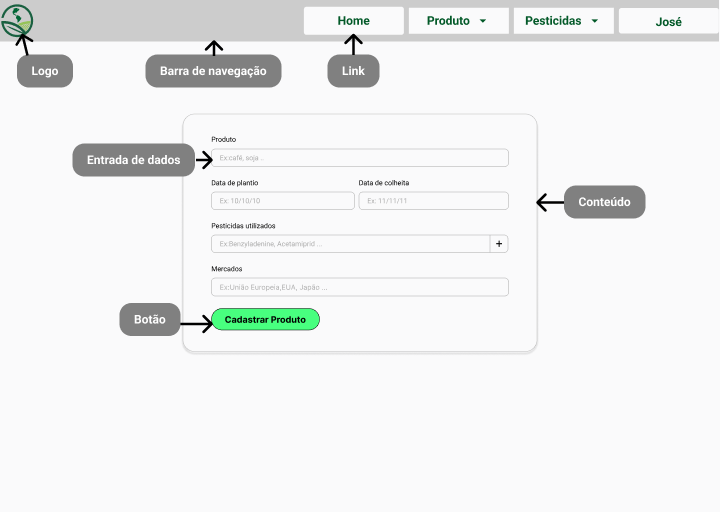
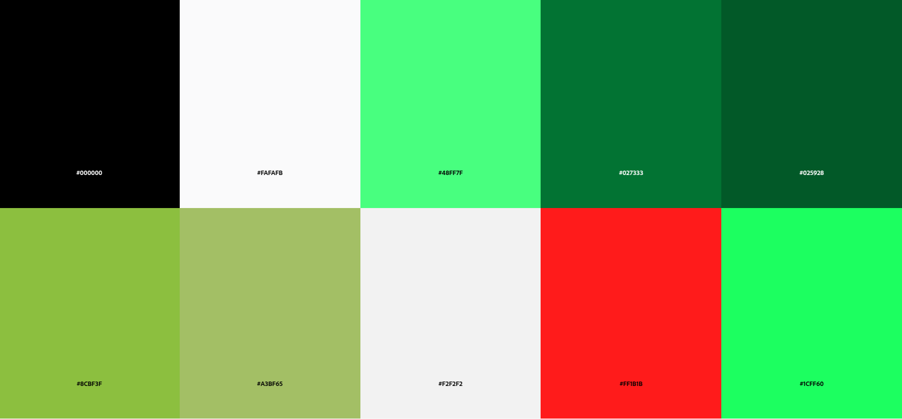
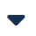
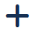
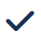
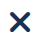

# Template padrão do site

Layout padrão desktop:

Layout padrão smartphone:

## Design

## Cores

As cores foram escolhidas para remeter a área a qual a aplicação está inserida

Detalhes sobre as cores adotadas:
- A cor #000000 será usada para textos;
- A cor #FAFAFB será usada para planos de fundo;
- A cor #48FF7F será a cor primária da aplicação;
- As cores #FF1B1B e #1CFF60 serão adotadas para indicar erros e sucessos, respectivamente;
- Algumas cores complementares são: #027333, #025928, #8CBF3F, #A3BF65 e #F2F2F2.

## Tipografia

A fonte adotada será a Roboto, com diferentes espessuras e tamanhos:
- Para títulos será usado a espessuras Bold com tamanho de 32px;
- Para subtítulos será usado a espessuras Regular com tamanho de 24px;
- Para os textos em geral da aplicação será usado a espessuras Regular com tamanho de 18px;
- Para textos auxiliares será usado a espessuras Regular com tamanho de 14px,

## Iconografia

Os ícones usados foram:

Para seguir para uma próxima página em listagens de registros:

Para retornar para uma página anterior em listagens de registros:

Indica um menu de opções suspenso:

Indica uma opção para adição de novos registros:

Indica algum informação bem sucedida:

Indica algum informação mal sucedida:

